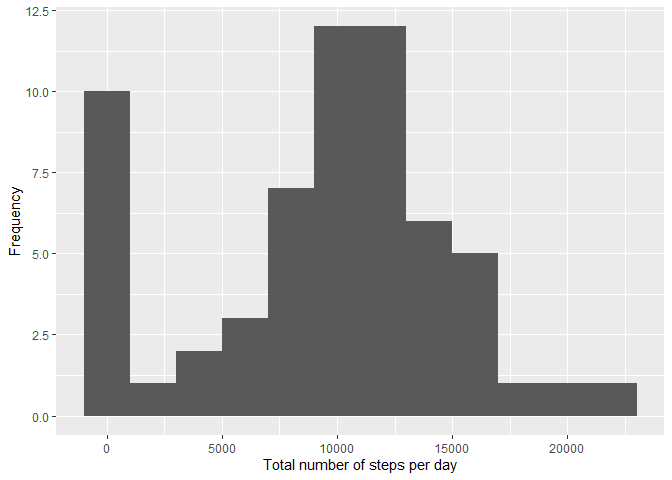
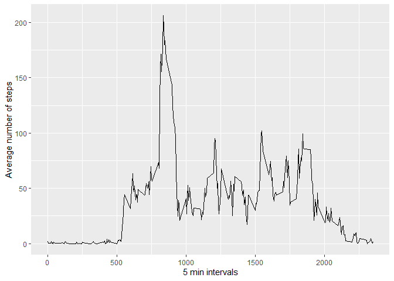
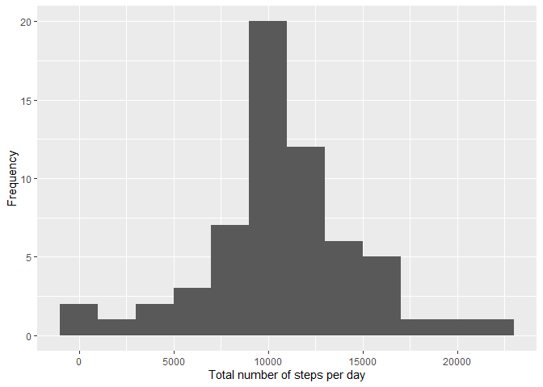
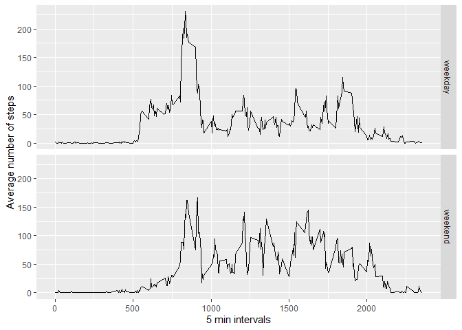

## Loading and preprocessing the data

```r
unzip(zipfile="activity.zip")
activity_data <- read.csv("activity.csv")
activity_data$date <- as.Date(activity_data$date)
```

## What is mean total number of steps taken per day?

```r
library(ggplot2)
library(dplyr)
```


```r
daily_steps <- tapply(activity_data$steps, activity_data$date, sum, na.rm=TRUE)
qplot(daily_steps, xlab='Total number of steps per day', ylab='Frequency', binwidth=2000)
```

<!-- -->

## What is the average daily activity pattern?

```r
daily_steps_mean <- round(mean(daily_steps), digits = 2)
daily_steps_median <- median(daily_steps)
```
* The mean is: 9354.23
* The median is: 10395


```r
steps_by_interval <- activity_data %>% group_by(interval) %>% summarize(steps_mean = mean(steps, na.rm = TRUE))
ggplot(data=steps_by_interval, aes(x=interval, y=steps_mean)) + geom_line() + xlab("5 min intervals") + ylab("Average number of steps")
```

<!-- -->

```r
interval_max <- steps_by_interval$interval[which.max(steps_by_interval$steps_mean)]
interval_max_steps <- round(max(steps_by_interval$steps_mean), digits=2)
```
* The interval containing the max number of steps is: 835
* The number of steps in that interval is: 206.17

## Imputing missing values

```r
daily_steps_mean <- round(mean(daily_steps), digits = 2)
daily_steps_median <- median(daily_steps)
```
* The mean is: 9354.23
* The median is: 10395


```r
missing_values_sum <- sum(is.na(activity_data$steps))
```
* There are missing: 2304 values

We replace missing values with the mean value for each interval

```r
imputed_activity_data <- activity_data

for (i in 1:nrow(activity_data)) {
  if(is.na(activity_data$steps[i])) {
    imputed_activity_data$steps[i] <-  steps_by_interval$steps_mean[imputed_activity_data$interval[i] == steps_by_interval$interval]
  }
}
imputed_daily_steps <- tapply(imputed_activity_data$steps, imputed_activity_data$date, sum, na.rm=TRUE)
qplot(imputed_daily_steps, xlab='Total number of steps per day', ylab='Frequency', binwidth=2000)
```

<!-- -->

```r
imputed_daily_steps_mean <- round(mean(imputed_daily_steps), digits = 2)
imputed_daily_steps_median <- median(imputed_daily_steps)
```
* The mean after imputing data is: 1.076619\times 10^{4}
* The median after imputing data is: 1.0766189\times 10^{4}


```r
mean_difference <- imputed_daily_steps_mean - daily_steps_mean
median_difference <- imputed_daily_steps_median - daily_steps_median
```
* The increase of mean after imputing missing values is: 1411.96
* The increase of median after imputing missing values is: 371.1886792

## Are there differences in activity patterns between weekdays and weekends?

```r
imputed_activity_data$date_type <- ifelse(as.POSIXlt(imputed_activity_data$date)$wday %in% c(0, 6), "weekend", "weekday")

imputed_activity_data_average <- aggregate(steps ~ interval + date_type, data = imputed_activity_data, mean)

ggplot(imputed_activity_data_average, aes(interval, steps)) + geom_line() + facet_grid(date_type ~ .) + xlab("5 min intervals") + ylab("Average number of steps")
```

<!-- -->

* During weekdays we observe a spike in morning intervals.
* During weekends it seems that walking is increasing in late morning an early afternoon.
